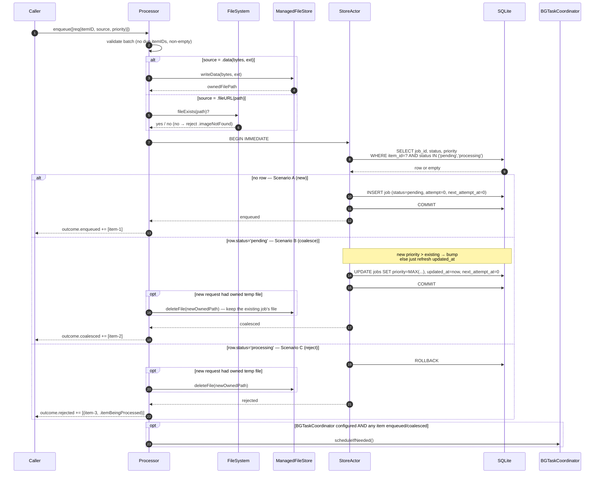
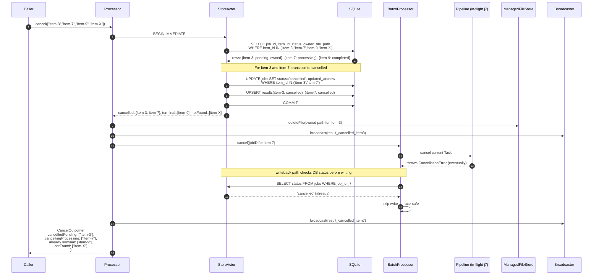
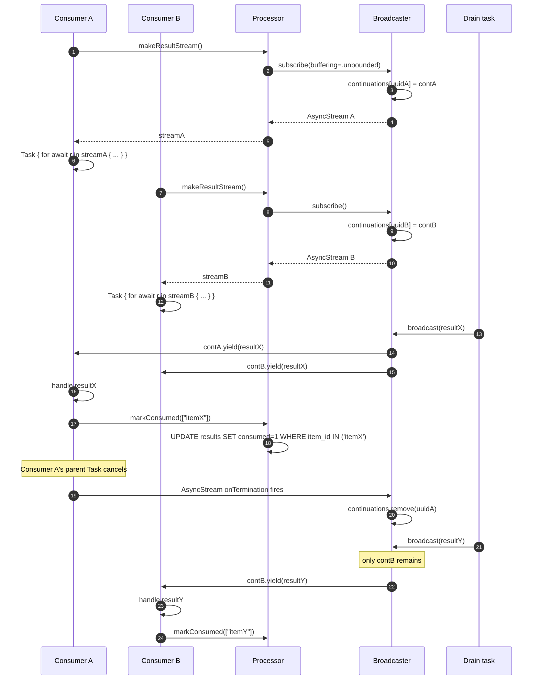

# BGVisualSemanticsProcessor — v1 Design Spec

Foolproof v1 design. Covers SPM layout, public API, internal models, storage schema, state machine, concurrency model, every code path, every failure mode, and the test matrix.

The library owns durable visual processing of images. It does not own app semantics. Consumers enqueue images, the library extracts visual signals (labels, type, quality), persists results in its own SQLite, and streams them out. Resilient to crashes, app suspension, BGTask expiration, iCloud unavailability, disk pressure, and concurrent drains.

---

## 1. SPM layout

```
BGVisualSemanticsProcessor (package)
├── Products
│   ├── BGVisualSemanticsProcessor       (core)
│   └── BGVisualSemanticsProcessorVision (Apple Vision impls)
└── Platforms: iOS 15+
```

**Core target — `BGVisualSemanticsProcessor`.** Foundation only. Imports `SQLite3` system module and `BackgroundTasks` (gated by `#if canImport(BackgroundTasks) && os(iOS)`). No Vision, no CoreML, no UIKit. Safe for share extensions and other UI-less contexts.

**Vision target — `BGVisualSemanticsProcessorVision`.** Imports core, `Vision`, `ImageIO`, `Photos`, `CoreImage`. Provides the default loader, preprocessor, label extractor, type detector, quality analyzer, and a convenience pipeline factory.

**No external dependencies.** SQLite via system module. Atomicity, concurrency, and broadcaster all built in-house.

---

## 2. Public API surface

```swift
public final class BGVisualSemanticsProcessor: Sendable {

    public init(
        configuration: VisualSemanticsConfiguration,
        pipeline: any VisualSemanticsPipeline,
        clock: any DateProvider = SystemDateProvider(),
        retryClassifier: any RetryClassifying = DefaultRetryClassifier(),
        logger: (any VisualSemanticsLogger)? = nil
    ) async throws

    public func enqueue(_ requests: [EnqueueRequest]) async throws -> EnqueueOutcome

    public func cancel(itemIDs: [String]) async throws -> CancelOutcome
    public func cancelAllPending() async throws -> Int

    public func processAvailableJobs(mode: ProcessingMode) async throws -> ProcessingSummary

    public func purgeExpiredResults() async throws -> Int
    public func resetStaleJobs() async throws -> Int

    public func pendingCount() async throws -> Int
    public func processingCount() async throws -> Int
    public func failedCount() async throws -> Int

    public func result(for itemID: String) async throws -> VisualSemanticsResult?
    public func pendingResults(limit: Int = .max) async throws -> [VisualSemanticsResult]

    public func markConsumed(itemIDs: [String]) async throws

    public func makeResultStream(
        bufferingPolicy: AsyncStream<VisualSemanticsResult>.Continuation.BufferingPolicy = .unbounded
    ) -> AsyncStream<VisualSemanticsResult>

    public func applicationDidBecomeActive() async
    public func applicationDidEnterBackground() async
}
```

### Outcome types

Outcomes are precise so callers can distinguish "enqueued 5 new + coalesced 2 + rejected 1" without throwing.

```swift
public struct EnqueueOutcome: Sendable, Equatable {
    public let enqueued: [String]
    public let coalesced: [String]
    public let rejected: [(itemID: String, reason: VisualSemanticsError)]
}

public struct CancelOutcome: Sendable, Equatable {
    public let cancelledPending: [String]
    public let cancellingProcessing: [String]
    public let alreadyTerminal: [String]
    public let notFound: [String]
}

public struct ProcessingSummary: Sendable, Equatable {
    public let processed: Int
    public let succeeded: Int
    public let failedTransient: Int
    public let failedPermanent: Int
    public let cancelled: Int
    public let skippedGated: Bool
}
```

---

## 3. Configuration

```swift
public struct VisualSemanticsConfiguration: Sendable {
    public let databaseLocation: DatabaseLocation
    public let backgroundTaskIdentifier: String?
    public let resultTTL: TimeInterval
    public let foregroundBatchSize: Int
    public let backgroundBatchSize: Int
    public let foregroundConcurrency: Int
    public let perJobTimeout: TimeInterval
    public let maxAttempts: Int
    public let staleProcessingTimeout: TimeInterval
    public let retry: RetryPolicy
    public let maxImageDimension: Int
    public let phAssetNetworkAccessForeground: Bool
    public let phAssetNetworkAccessBackground: Bool
    public let managedTempDirectoryName: String
    public let purgeUnconsumedExpiredResults: Bool
}

public enum DatabaseLocation: Sendable {
    case `default`
    case path(String)
    case inMemory
}

public struct RetryPolicy: Sendable {
    public let baseDelay: TimeInterval
    public let maxDelay: TimeInterval
    public let jitterFraction: Double
}
```

Defaults:

```swift
public extension VisualSemanticsConfiguration {
    static func `default`(
        databaseLocation: DatabaseLocation = .default,
        backgroundTaskIdentifier: String? = nil
    ) -> Self {
        .init(
            databaseLocation: databaseLocation,
            backgroundTaskIdentifier: backgroundTaskIdentifier,
            resultTTL: 86_400,
            foregroundBatchSize: 30,
            backgroundBatchSize: 5,
            foregroundConcurrency: 3,
            perJobTimeout: 30,
            maxAttempts: 3,
            staleProcessingTimeout: 15 * 60,
            retry: .init(baseDelay: 30, maxDelay: 3600, jitterFraction: 0.2),
            maxImageDimension: 1024,
            phAssetNetworkAccessForeground: true,
            phAssetNetworkAccessBackground: false,
            managedTempDirectoryName: "BGVisualSemanticsProcessor"
        )
    }
}
```

`init` validates: `foregroundBatchSize >= 1`, `backgroundBatchSize >= 1`, `foregroundConcurrency >= 1`, `maxAttempts >= 1`, `perJobTimeout > 0`. Invalid → throws `.configurationInvalid`.

---

## 4. Models

### Image source

```swift
public enum ImageSourceReference: Sendable, Hashable {
    case fileURL(path: String)
    case phAssetLocalIdentifier(String)
    case data(Data, suggestedExtension: String)
}
```

`Codable` is **custom**, not synthesized. Discriminator field `kind` so future cases don't break stored JSON. `.data` is **never persisted as base64**. On enqueue, `.data` is materialised to a managed temp file by `ManagedFileStore`; the persisted form is internally `.fileURL` with an `ownedByLibrary=true` flag (separate column, not encoded into the source JSON).

### Job

Internal type — not exposed publicly except via diagnostic accessors if needed later.

```swift
struct VisualSemanticsJob: Sendable, Equatable {
    let jobID: String
    let itemID: String
    let source: PersistedImageSource
    let priority: JobPriority
    var status: JobStatus
    var attemptCount: Int
    var nextAttemptAt: Date
    let createdAt: Date
    var updatedAt: Date
    var lastError: PersistedJobError?
    let ownedFilePath: String?
}

enum PersistedImageSource: Sendable, Equatable {
    case fileURL(String)
    case phAsset(String)
}

enum JobStatus: String, Sendable, Equatable {
    case pending, processing, completed, failed, cancelled
}

public enum JobPriority: Int, Codable, Sendable, Comparable, Equatable {
    case low = 0, normal = 1, high = 2
    public static func < (lhs: Self, rhs: Self) -> Bool { lhs.rawValue < rhs.rawValue }
}

struct PersistedJobError: Sendable, Equatable {
    let code: String
    let message: String
    let isTransient: Bool
}
```

### Enqueue request

```swift
public struct EnqueueRequest: Sendable {
    public let itemID: String
    public let source: ImageSourceReference
    public let priority: JobPriority
    public init(itemID: String, source: ImageSourceReference, priority: JobPriority = .normal)
}
```

### Result

```swift
public struct VisualSemanticsResult: Codable, Sendable, Equatable {
    public let itemID: String
    public let jobID: String
    public let sourceHash: String?
    public let modelVersion: String
    public let resultStatus: ResultStatus
    public let imageType: VisualImageType?
    public let labels: [VisualLabel]
    public let quality: ImageQuality?
    public let embedding: VisualEmbedding?
    public let error: ResultError?
    public let createdAt: Date
    public let expiresAt: Date
}

public enum ResultStatus: String, Codable, Sendable {
    case completed, failed, cancelled
}

public struct ResultError: Codable, Sendable, Equatable {
    public let code: String
    public let message: String
}

public struct VisualLabel: Codable, Sendable, Equatable {
    public let name: String
    public let confidence: Double
    public let source: VisualLabelSource
}

public enum VisualLabelSource: Sendable, Equatable {
    case vision(version: String)
    case coreML(modelID: String)
    case heuristic(name: String)
}

public enum VisualImageType: String, Codable, Sendable {
    case screenshot, document, receipt, photo, unknown
}

public struct ImageQuality: Codable, Sendable, Equatable {
    public let sharpness: Double?
    public let brightness: Double?
}

public struct VisualEmbedding: Codable, Sendable, Equatable {
    public let modelID: String
    public let dimensions: Int
    public let vector: [Float]
}
```

`VisualLabelSource` Codable is custom with a discriminator — same reason as `ImageSourceReference`.

`VisualImageType` is the **primitive-only** taxonomy. Photo subtypes (food, person, place, product) are **not** in the enum — consumers derive them from `labels`. This is the v1 commitment.

### Errors

```swift
public enum VisualSemanticsError: Error, Sendable, Equatable {
    case imageNotFound(reason: String)
    case imageDecodeFailed(reason: String)
    case unsupportedImageSource(reason: String)
    case processingCancelled
    case modelUnavailable(name: String)
    case storageFailure(reason: String)
    case pipelineFailure(reason: String, isTransient: Bool)
    case duplicateItemIDsInBatch(itemIDs: [String])
    case itemBeingProcessed(itemID: String)
    case configurationInvalid(reason: String)
    case databaseSchemaIncompatible(have: Int, expected: Int)
}
```

---

## 5. Pipeline contract

```swift
public protocol VisualSemanticsPipeline: Sendable {
    func process(_ context: PipelineContext) async throws -> PipelineOutput
}

public struct PipelineContext: Sendable {
    public let jobID: String
    public let itemID: String
    public let source: ImageSourceReference
    public let modeHint: ProcessingMode
}

public struct PipelineOutput: Sendable {
    public let sourceHash: String?
    public let modelVersion: String
    public let imageType: VisualImageType?
    public let labels: [VisualLabel]
    public let quality: ImageQuality?
    public let embedding: VisualEmbedding?
}
```

The pipeline never persists. It is pure function: `(context) → output`. Persistence is engine concern.

`modeHint` lets implementations adapt — e.g. `DefaultImageLoader` uses `phAssetNetworkAccessBackground=false` when `modeHint == .background`.

### Component protocols

```swift
public protocol ImageLoading: Sendable {
    func loadImage(from source: ImageSourceReference, mode: ProcessingMode) async throws -> LoadedImage
}

public protocol ImagePreprocessing: Sendable {
    func preprocess(_ image: LoadedImage, maxDimension: Int) async throws -> PreprocessedImage
}

public protocol VisualLabelExtracting: Sendable {
    var modelVersion: String { get }
    func extractLabels(from image: PreprocessedImage) async throws -> [VisualLabel]
}

public protocol ImageTypeDetecting: Sendable {
    func detectImageType(image: PreprocessedImage, labels: [VisualLabel]) async throws -> VisualImageType
}

public protocol ImageQualityAnalyzing: Sendable {
    func analyzeQuality(image: PreprocessedImage) async throws -> ImageQuality
}

public protocol VisualEmbeddingProviding: Sendable {
    var modelID: String { get }
    var dimensions: Int { get }
    func embed(image: PreprocessedImage) async throws -> VisualEmbedding
}

public struct LoadedImage: Sendable {
    public let cgImage: CGImage
    public let width: Int
    public let height: Int
    public let sourceHash: String?
}

public struct PreprocessedImage: Sendable {
    public let cgImage: CGImage
    public let pixelBuffer: CVPixelBuffer?
    public let sourceHash: String?
    public let width: Int
    public let height: Int
}
```

### CompositePipeline (in core)

```swift
public struct CompositePipeline: VisualSemanticsPipeline {
    public init(
        imageLoader: any ImageLoading,
        preprocessor: any ImagePreprocessing,
        labelExtractor: any VisualLabelExtracting,
        imageTypeDetector: any ImageTypeDetecting,
        qualityAnalyzer: (any ImageQualityAnalyzing)? = nil,
        embeddingProvider: (any VisualEmbeddingProviding)? = nil,
        maxImageDimension: Int = 1024
    )
    public func process(_ context: PipelineContext) async throws -> PipelineOutput
}
```

Internal flow:

```
loadImage(source, mode)
  → preprocess(image, maxDimension)        ← cancellation check before & after
  → async let labels = extractLabels(...)
  → async let typeFromLabels = ...         ← (depends on labels)
  → async let quality = analyzeQuality(...) (if provided)
  → async let embedding = embed(...)        (if provided)
  → await all
  → assemble PipelineOutput
```

Rules:
- `Task.checkCancellation()` between every stage.
- All errors are typed `VisualSemanticsError`. Pipeline implementations wrap unknown errors as `.pipelineFailure(reason:isTransient:)`.
- Pipeline does not catch `CancellationError` — propagates up to be mapped to `.processingCancelled` by the engine.

---

## 6. SQLite schema

PRAGMAs at every connection open:

```sql
PRAGMA journal_mode = WAL;
PRAGMA synchronous = NORMAL;
PRAGMA foreign_keys = ON;
PRAGMA temp_store = MEMORY;
PRAGMA busy_timeout = 5000;
```

Tables:

```sql
CREATE TABLE schema_meta (
    key   TEXT PRIMARY KEY,
    value TEXT NOT NULL
);

CREATE TABLE visual_semantics_jobs (
    job_id              TEXT PRIMARY KEY,
    item_id             TEXT NOT NULL,
    source_kind         TEXT NOT NULL CHECK(source_kind IN ('fileURL','phAsset')),
    source_value        TEXT NOT NULL,
    owned_file_path     TEXT,
    priority            INTEGER NOT NULL,
    status              TEXT NOT NULL CHECK(status IN
                          ('pending','processing','completed','failed','cancelled')),
    attempt_count       INTEGER NOT NULL DEFAULT 0,
    next_attempt_at     REAL NOT NULL DEFAULT 0,
    created_at          REAL NOT NULL,
    updated_at          REAL NOT NULL,
    last_error_code     TEXT,
    last_error_message  TEXT,
    last_error_transient INTEGER
);

CREATE INDEX idx_jobs_dequeue
  ON visual_semantics_jobs(status, priority DESC, next_attempt_at ASC, created_at ASC);

CREATE INDEX idx_jobs_stale
  ON visual_semantics_jobs(status, updated_at)
  WHERE status = 'processing';

CREATE INDEX idx_jobs_item
  ON visual_semantics_jobs(item_id);

CREATE UNIQUE INDEX uq_jobs_active_per_item
  ON visual_semantics_jobs(item_id)
  WHERE status IN ('pending','processing');

CREATE TABLE visual_semantics_results (
    item_id         TEXT PRIMARY KEY,
    job_id          TEXT NOT NULL,
    result_json     TEXT NOT NULL,
    result_status   TEXT NOT NULL CHECK(result_status IN ('completed','failed','cancelled')),
    consumed        INTEGER NOT NULL DEFAULT 0,
    created_at      REAL NOT NULL,
    updated_at      REAL NOT NULL,
    expires_at      REAL NOT NULL
);

CREATE INDEX idx_results_unconsumed
  ON visual_semantics_results(consumed, created_at)
  WHERE consumed = 0;

CREATE INDEX idx_results_sweep
  ON visual_semantics_results(expires_at);
```

Notes:
- The unique partial index `uq_jobs_active_per_item` enforces "at most one live job per itemID" at DB level. Coalescing logic relies on this.
- `next_attempt_at` is in dequeue index so backoff is "free" — no application-side filtering.
- Source is split into `source_kind` + `source_value` (not a JSON blob) for indexability and readability during debugging. JSON wrapper is unnecessary for two cases.

---

## 7. Job state machine

```
              enqueue
                │
                ▼
            ┌────────┐   claim   ┌────────────┐
            │pending ├──────────▶│ processing │
            └───┬────┘           └─────┬──────┘
                │                      │
                │   cancel()           │  pipeline success
                ▼                      ▼
            ┌────────┐           ┌────────────┐
            │cancelled│          │ completed  │
            └─────────┘          └────────────┘
                ▲                      ▲
       cancel during                   │
       processing (Task                │
       cancellation)                   │
                │                      │
                │     transient err    │
                │     attempt < max    │
                │            ┌─────────┴──────┐
                │            │   pipeline     │
                │            │  permanent err │
                │            │      OR        │
                │            │ attempt == max │
                │            ▼                │
                │       ┌────────┐            │
                │       │ failed │            │
                │       └────────┘            │
                │                             │
                └─────────────────────────────┘
                        ↻ pending (transient retry, attempt+1)
```

**Transitions and what each writes:**

| From | To | Trigger | DB writes |
|---|---|---|---|
| (none) | pending | `enqueue` (new) | INSERT job |
| pending | pending | `enqueue` (coalesce) | UPDATE priority, updated_at |
| pending | processing | claim | UPDATE status, attempt_count+1, updated_at |
| pending | cancelled | `cancel` | UPDATE status; INSERT/UPSERT result(cancelled) |
| processing | completed | pipeline success | UPDATE status, updated_at; UPSERT result(completed) |
| processing | failed | permanent err OR attempts exhausted | UPDATE status, last_error*; UPSERT result(failed) |
| processing | pending | transient err, attempts left | UPDATE status, last_error*, next_attempt_at |
| processing | cancelled | mid-flight cancel | UPDATE status; UPSERT result(cancelled) |
| processing | pending | stale recovery | UPDATE status, updated_at (no attempt bump) |

Terminal states are `completed`, `failed`, `cancelled`. Re-enqueueing the same `itemID` after terminal state replaces the old row (see Enqueue path).

---

## 8. Concurrency architecture

```
                ┌─────────────────────────────────────────────┐
                │     BGVisualSemanticsProcessor (facade)     │
                │     (final class, Sendable, all-async API)  │
                └──┬──────────────┬───────────┬──────────┬────┘
                   │              │           │          │
                   ▼              ▼           ▼          ▼
            ┌──────────┐   ┌────────────┐  ┌─────────┐  ┌──────────┐
            │ StoreActor│   │Processing  │  │Result   │  │Managed   │
            │ (SQLite) │   │ Gate       │  │Broad-   │  │FileStore │
            └──────────┘   └────────────┘  │caster   │  └──────────┘
                                           └─────────┘
                                           
                   ┌────────────────┐
                   │ BatchProcessor │  ← tracks in-flight jobID → Task
                   │ (actor)        │     (for cancel propagation)
                   └────────────────┘
                   
                   ┌────────────────┐
                   │BGTaskCoordinator│
                   │ (optional, iOS) │
                   └────────────────┘
```

- **`StoreActor`** serializes every SQLite operation. Single SQLite connection inside (WAL means readers don't need a separate connection at this scale; if profiling shows contention, split into reader pool later).
- **`ProcessingGate`** is a single-bool actor. `enter()` returns false if a drain is already running. Prevents BGTask + foreground races and reentrant calls.
- **`ResultBroadcaster`** holds `[UUID: AsyncStream.Continuation]`. `subscribe()` registers a continuation. `broadcast(_ result:)` yields to all. On consumer cancel, `onTermination` removes the continuation.
- **`BatchProcessor`** owns the per-drain TaskGroup logic and a map `[String: Task<Void, Error>]` from jobID to in-flight Task. `cancel(jobID:)` cancels the Task; pipeline observes `Task.checkCancellation` and aborts.
- **`ManagedFileStore`** owns the temp directory. Allocates files for `.data` enqueues, deletes on terminal job state, sweeps orphans at init.

All components are `Sendable`. The facade is a `final class` with `let`-only properties (each property is itself an actor or a `Sendable` value type).

---

## 9. Enqueue — every branch

```swift
public func enqueue(_ requests: [EnqueueRequest]) async throws -> EnqueueOutcome
```

### Pre-checks (before any DB work)

1. **Empty batch** → return `EnqueueOutcome(enqueued: [], coalesced: [], rejected: [])`. No-op success.
2. **Duplicate itemIDs within the batch** → throws `.duplicateItemIDsInBatch(itemIDs:)`. We don't try to merge within-batch duplicates.
3. For each request:
   - `.fileURL(path)`: if `FileManager.default.fileExists(atPath: path) == false`, **add to rejected** with `.imageNotFound("file does not exist at enqueue")`. Continue with rest of batch.
   - `.phAssetLocalIdentifier`: cannot validate without Photos in core. Defer to pipeline; accept for now.
   - `.data(_, ext)`: write to `ManagedFileStore`. On write failure, **reject** with `.storageFailure`.
4. After resolution, each request now has a `PersistedImageSource` and an optional `ownedFilePath`.

### DB transaction (single `BEGIN IMMEDIATE`)

For each prepared request:

```sql
SELECT job_id, status, priority FROM visual_semantics_jobs
  WHERE item_id = ? AND status IN ('pending','processing');
```

Branches:

- **No row.** Standard new enqueue:
  - Optionally `DELETE FROM visual_semantics_results WHERE item_id = ?` if a stale prior result exists (we want fresh state). Actually no — we **keep** the prior result until the new job completes, so consumers calling `result(for:)` during the gap still see something. The new completed result will overwrite. Deletion happens via `markConsumed` or expiry sweep. This is a **decision**: keep stale results visible until overwritten.
  - `INSERT` job with `status='pending'`, `attempt_count=0`, `next_attempt_at=0`, `created_at=updated_at=now`.
  - Add itemID to `enqueued`.

- **Existing row, status='pending'.** Coalesce:
  - If new priority > existing: `UPDATE … SET priority = ?, updated_at = ?` (and `next_attempt_at = 0` to expedite).
  - If new priority ≤ existing: `UPDATE … SET updated_at = ?` (just refresh).
  - **Do not** create a second job. The old `ownedFilePath` (if any) remains; if the new request had a different owned file, **delete** the new owned file we just created (don't leak).
  - Add itemID to `coalesced`.

- **Existing row, status='processing'.** Reject with `.itemBeingProcessed(itemID:)`.
  - Caller's options: wait for result and re-enqueue, or call `cancel([itemID])` then re-enqueue.
  - If the new request had an owned temp file, delete it.

After batch, `COMMIT`. If commit fails, rollback and **delete all owned temp files we just allocated**.

### Edge cases
- **Disk full** during temp file write: that single request rejected, others still attempted.
- **Caller passed itemID="" or whitespace-only**: reject with `.configurationInvalid("empty itemID")`. Validate in pre-checks.
- **`.data` with empty Data**: reject with `.imageDecodeFailed("empty data")`.
- **Same itemID enqueued twice in rapid succession from different callers**: SQLite `BEGIN IMMEDIATE` serializes; second call sees the first's row and coalesces. Correct.

---

## 10. Drain — every branch

```swift
public func processAvailableJobs(mode: ProcessingMode) async throws -> ProcessingSummary
```

### Step 1: Gate

```
if await !gate.enter() {
    return ProcessingSummary(skippedGated: true, …zeros)
}
defer { Task { await gate.leave() } }
```

Concurrent calls don't queue — they short-circuit. Caller can decide to retry.

### Step 2: Optional pre-sweep

If `configuration.purgeUnconsumedExpiredResults` is true, run `purgeExpiredResults()` opportunistically. Cheap query.

Also: `resetStaleJobs()` runs only on init, not on every drain (would otherwise interfere with currently-processing jobs from the same instance). Document this.

### Step 3: Claim batch

```sql
BEGIN IMMEDIATE;
SELECT job_id FROM visual_semantics_jobs
  WHERE status = 'pending' AND next_attempt_at <= ?
  ORDER BY priority DESC, next_attempt_at ASC, created_at ASC
  LIMIT ?;
-- … then …
UPDATE visual_semantics_jobs
   SET status = 'processing',
       attempt_count = attempt_count + 1,
       updated_at = ?
   WHERE job_id IN (?, ?, …);
COMMIT;
```

Read full job rows for the claimed IDs into memory.

If 0 claimed → return `ProcessingSummary(processed:0, …)`.

### Step 4: Execute

**Foreground mode** — bounded-concurrency TaskGroup:

```swift
try await withThrowingTaskGroup(of: JobOutcome.self) { group in
    var iter = jobs.makeIterator()
    var inFlight = 0
    while inFlight < configuration.foregroundConcurrency, let job = iter.next() {
        group.addTask { try await self.runOne(job, mode: .foreground) }
        inFlight += 1
    }
    while let outcome = try await group.next() {
        record(outcome)
        if let job = iter.next() {
            group.addTask { try await self.runOne(job, mode: .foreground) }
        }
    }
}
```

**Background mode** — sequential, observes `BGTask` expiration via shared cancellation token (see §11).

```swift
for job in jobs {
    if Task.isCancelled { break }
    let outcome = try await runOne(job, mode: .background)
    record(outcome)
    if Task.isCancelled { break }
}
```

### Step 5: `runOne` — every branch

```swift
private func runOne(_ job: VisualSemanticsJob, mode: ProcessingMode) async -> JobOutcome
```

Wraps pipeline call with timeout, catches everything, classifies, writes to store, broadcasts.

```
1. Register Task in BatchProcessor (jobID → current Task handle).
2. Construct PipelineContext.
3. Run pipeline with per-job timeout:
   try await withThrowingTaskGroup { g in
       g.addTask { try await pipeline.process(ctx) }
       g.addTask { try await Task.sleep(seconds: perJobTimeout); throw TimeoutError() }
       let result = try await g.next()!
       g.cancelAll()
       return result
   }
4. Classify outcome:
   - success → write completed result; broadcast.
   - CancellationError → see §10.6.
   - VisualSemanticsError, isTransient(error) == false → permanent fail.
   - VisualSemanticsError, isTransient(error) == true →
       if attemptCount >= maxAttempts → permanent fail.
       else → transient retry.
   - TimeoutError → treat as transient (.pipelineFailure(reason:"timeout", isTransient:true)).
   - Any other Error → treat as transient by default (DefaultRetryClassifier).
5. Persist via StoreActor (single transaction):
   - completed: UPDATE job → completed; UPSERT result with status=completed.
                Delete owned_file_path if any.
   - failed (permanent): UPDATE job → failed, last_error*; UPSERT result with status=failed.
                          Delete owned_file_path if any.
   - cancelled: UPDATE job → cancelled; UPSERT result with status=cancelled.
                Delete owned_file_path if any.
   - retry: UPDATE job → pending, last_error*, next_attempt_at = now + backoff(attempt).
            Keep owned_file_path.
6. Unregister from BatchProcessor.
7. If terminal → broadcaster.broadcast(result).
```

### 10.6 Cancellation semantics during processing

- If `cancel(itemIDs:)` is called for a job currently in step 3 (pipeline running), `BatchProcessor.cancel(jobID:)` cancels that Task. Pipeline observes `Task.checkCancellation()` between stages and throws `CancellationError`.
- The outcome path goes "cancelled".
- Special case: pipeline may already have produced partial work. We **do not** persist a partial result. We persist a `cancelled` result with no labels.

### 10.7 Backoff calculation

```swift
func nextAttemptDelay(attempt: Int) -> TimeInterval {
    let exp = min(retry.maxDelay, retry.baseDelay * pow(2, Double(attempt - 1)))
    let jitter = exp * retry.jitterFraction * (Double.random(in: -1...1))
    return max(0, exp + jitter)
}
```

`attempt` is `attemptCount` *after* this failure (so first retry has delay `baseDelay`). Capped at `maxDelay`.

### 10.8 Drain edge cases
- **Pipeline returns no labels**: valid completed result with empty labels.
- **Pipeline returns label confidence > 1.0 or < 0**: do not validate. Document that consumers should be defensive. Adding validation is a v2 decision.
- **Image file deleted between claim and load**: `.imageNotFound`, permanent.
- **Memory pressure mid-drain**: BGTask gets killed, app crashes — claimed rows remain `processing`. Recovered on next init by `resetStaleJobs`.
- **Consumer holds the actor's queue forever via long markConsumed batch**: not really possible since markConsumed is fast, but document that all DB ops should be quick.
- **Two foreground drains called rapidly**: gate denies the second. Returns `skippedGated: true`.

---

## 11. Cancellation — every branch

```swift
public func cancel(itemIDs: [String]) async throws -> CancelOutcome
public func cancelAllPending() async throws -> Int
```

### `cancel(itemIDs:)`

Single transaction:

```sql
BEGIN IMMEDIATE;
SELECT job_id, item_id, status, owned_file_path
  FROM visual_semantics_jobs
  WHERE item_id IN (?, ?, …);
```

For each itemID:
- **Not found**: → `notFound`.
- **status='pending'**: UPDATE → cancelled. UPSERT result(cancelled). Delete owned file. → `cancelledPending`. **Broadcast** the cancelled result.
- **status='processing'**: UPDATE status to `'cancelled'` immediately. UPSERT result(cancelled). Schedule `BatchProcessor.cancel(jobID:)` outside the transaction (don't await inside). → `cancellingProcessing`.
  - The in-flight `runOne` will see Task.isCancelled and exit. When it goes to write its own outcome, it'll see the row already cancelled — don't overwrite. (Implement via "did terminal write happen via cancel path? skip in runOne".)
- **status='completed'/'failed'/'cancelled'**: → `alreadyTerminal`. No write.

`COMMIT;`

After commit:
- Call `BatchProcessor.cancel(jobID:)` for each in `cancellingProcessing`.
- Broadcast cancelled results for all newly-cancelled (pending and processing).

### `cancelAllPending`

```sql
UPDATE visual_semantics_jobs
   SET status = 'cancelled', updated_at = ?
   WHERE status = 'pending'
   RETURNING item_id, owned_file_path;
```

For each: UPSERT cancelled result, delete owned file, broadcast. Returns count.

Does **not** affect `processing` jobs (use `cancel(itemIDs:)` for those, or just don't — they'll finish quickly).

### Edge cases
- **Cancel called, then drain claims that job's row** — impossible. Cancel transitions out of pending atomically; claim queries `WHERE status='pending'`.
- **Cancel during stale recovery race** — recovery uses `WHERE status='processing'`, cancel uses `WHERE item_id IN …`. Both are atomic, last write wins. If recovery resets to pending and cancel races, cancel sees pending and cancels. Fine.
- **Cancel a job where pipeline already completed but writeback hasn't happened yet**: cancel transaction sees status='processing', writes cancelled. Pipeline writeback then sees status no longer 'processing' (we check). It skips. No double-write. Result is cancelled. Edge: completed work discarded. Acceptable — caller asked to cancel.

---

## 12. BGTask lifecycle

`BGTaskCoordinator` is the only place that touches `BGTaskScheduler`. Two responsibilities: register (at app launch) and schedule (after enqueue / when entering background with pending work).

```swift
@available(iOS 13.0, *)
public final class BGTaskCoordinator: Sendable {
    public init(identifier: String, processor: BGVisualSemanticsProcessor)
    public func register()
    public func scheduleIfNeeded() async
    public func cancelScheduled()
}
```

### Register (call once, at app launch, on main actor)

```swift
BGTaskScheduler.shared.register(forTaskWithIdentifier: identifier, using: nil) { task in
    guard let task = task as? BGProcessingTask else { return task.setTaskCompleted(success: false) }
    Task {
        let token = ExpirationToken()
        task.expirationHandler = { token.cancel() }
        let summary = await self.runBackground(token: token)
        if await self.processor.pendingCount() > 0, !token.isCancelled {
            await self.scheduleIfNeeded()
        }
        task.setTaskCompleted(success: summary.failedTransient == 0)
    }
}
```

`ExpirationToken` is a small actor with `cancel()` and `isCancelled`. Used to cancel the in-flight Task tree (we pass it through to `BatchProcessor` as a "stop after current job" signal in addition to Task.cancellation).

### Schedule

```swift
public func scheduleIfNeeded() async {
    guard await processor.pendingCount() > 0 else { return }
    let request = BGProcessingTaskRequest(identifier: identifier)
    request.requiresNetworkConnectivity = false
    request.requiresExternalPower = false
    do { try BGTaskScheduler.shared.submit(request) }
    catch BGTaskScheduler.Error.tooManyPendingTaskRequests { /* already scheduled, fine */ }
    catch { logger?.warn("BGTask submit failed: \(error)") }
}
```

Called from:
- `enqueue` completion (if any items enqueued and app is in background — see §13).
- `applicationDidEnterBackground` if `pendingCount > 0`.
- After a BG drain that left pending work.

### BG drain flow

```
BGTask launched
  → start ExpirationToken
  → call processor.processAvailableJobs(mode: .background)
      → gate.enter()
      → claim batch (size = backgroundBatchSize)
      → for each job, sequentially:
          → if token.isCancelled || Task.isCancelled, break
          → runOne(job, .background)  ← per-job timeout still applies
          → write outcome
      → gate.leave()
  → if pending remain and not expired, schedule next request
  → setTaskCompleted(success: …)
```

### BGTask edge cases

- **Expiration during a job**: token cancels, current Task gets cancelled, pipeline aborts at next `Task.checkCancellation()`. Job goes to "cancelled" outcome path? **No** — BG expiration is not a user cancel. Treat as transient retry (don't write cancelled result, just leave job in pending with attempt count incremented or roll back attempt count).
  - **Decision**: BG expiration → **rollback the claim** for the in-flight job. Don't increment attempt count for jobs interrupted by BG expiration. Implementation: when token fires, the in-flight runOne catches the propagated CancellationError, distinguishes "user cancel via cancel(itemID:)" vs "BG expiration cancel" via the token, and writes back accordingly:
    - User cancel → cancelled outcome.
    - BG expiration → revert status='pending', attempt_count -= 1 (so net zero).
  - Jobs not yet claimed are unaffected.
- **BGTask never runs**: no problem, foreground will pick up on next launch.
- **BGTask runs but no pending jobs**: enter, claim 0, exit, complete success, no reschedule.
- **App killed while BGTask scheduled**: iOS retains the request; will fire on next opportunity. App must call `register()` again on launch.
- **Multiple BGTasks scheduled rapidly**: `tooManyPendingTaskRequests` thrown; we swallow — fine.
- **Foreground drain in progress when BGTask fires**: gate denies BG drain. BGTask returns `setTaskCompleted(success: true)` and reschedules (foreground will finish, but pending work might remain).
- **`backgroundTaskIdentifier == nil` in config**: `BGTaskCoordinator` is not constructed; library still works in foreground only.

---

## 13. Lifecycle integration

The library does **not** observe UIApplication notifications. Host calls:

```swift
public func applicationDidBecomeActive() async
public func applicationDidEnterBackground() async
```

`applicationDidBecomeActive`:
- Reset stale jobs (`resetStaleJobs()` — see §15).
- Optionally trigger a foreground drain if `pendingCount > 0` (configurable; default yes).

`applicationDidEnterBackground`:
- If `BGTaskCoordinator` configured and `pendingCount > 0`, schedule a BG task.

This decision keeps the library testable and extension-safe. A separate optional helper `AppLifecycleAdapter` (in a tiny `BGVisualSemanticsProcessorAppKit` target if we ever want it) can observe notifications and forward to these methods. Not built in v1.

---

## 14. Result streaming (broadcaster)

```swift
actor ResultBroadcaster {
    private var continuations: [UUID: AsyncStream<VisualSemanticsResult>.Continuation] = [:]

    func subscribe(
        bufferingPolicy: AsyncStream<VisualSemanticsResult>.Continuation.BufferingPolicy
    ) -> AsyncStream<VisualSemanticsResult> {
        let id = UUID()
        return AsyncStream(VisualSemanticsResult.self, bufferingPolicy: bufferingPolicy) { cont in
            self.continuations[id] = cont   // (must hop onto the actor)
            cont.onTermination = { _ in
                Task { await self.removeContinuation(id) }
            }
        }
    }

    func broadcast(_ result: VisualSemanticsResult) {
        for cont in continuations.values { cont.yield(result) }
    }

    func removeContinuation(_ id: UUID) { continuations.removeValue(forKey: id) }
}
```

(The `AsyncStream` builder closure isn't on the actor — bridge with `Task { await self.register(id, cont) }`. Or use a slight refactor: keep continuations behind a synchronous lock since they're trivially thread-safe to insert. Pattern of choice: `OSAllocatedUnfairLock` from `os` — Sendable, fast, no actor hop on broadcast.)

### Edge cases
- **No subscribers when result arrives**: broadcast is a no-op. Result is still in DB; consumer can fetch via `pendingResults()` later.
- **Subscriber slow / never reads**: depends on `bufferingPolicy`. Default `.unbounded` — keep all (memory risk if app forgets to consume). Document: pair `pendingResults()` with stream, do not rely on stream alone for backlog.
- **Subscriber cancels iteration**: `onTermination` fires, continuation removed.
- **App backgrounded while subscriber iterating**: continuations remain; broadcasts continue. Consumer's Task may be suspended, AsyncStream buffers (per policy).
- **Multiple subscribers**: each gets every result. No fan-out coalescing.

---

## 15. Stale recovery

Runs at `init` and on `applicationDidBecomeActive`. Not on every drain.

```sql
UPDATE visual_semantics_jobs
   SET status = 'pending', updated_at = ?
   WHERE status = 'processing' AND updated_at < ?
   RETURNING item_id;
```

Threshold = `now - staleProcessingTimeout`.

Note: at init time, **all** processing rows are stale by definition (the only writer is this process and we just started). So at init we use threshold = `now` (or `Date.distantFuture` cap, anything above all timestamps), recovering all. At become-active time we use the configured threshold (in case foreground processing was paused but not killed — multitasking weirdness on iPad).

Recovery does **not** increment `attempt_count`. The previous attempt was interrupted, not failed.

### Edge cases
- **Recovery during a drain**: don't run recovery during a drain; gate ensures only one. Call recovery before claim phase if needed.
- **Multiple instances of the library against the same DB** (e.g., main app + extension): not supported. SQLite WAL allows it but our recovery logic assumes single-writer-process. **Document loudly**: "do not point two BGVisualSemanticsProcessor instances at the same DB path."

---

## 16. Managed file store

For `.data` enqueues, library writes to a directory it owns:

```
<caches>/BGVisualSemanticsProcessor/temp/<uuid>.<ext>
```

(`<caches>` = `FileManager.default.urls(for: .cachesDirectory, in: .userDomainMask).first!`)

Caches is correct because:
- iOS may purge under disk pressure — and that's tolerable. Lost file → next attempt fails with `.imageNotFound`, retry exhausted, job goes failed. Acceptable.
- Not backed up by iCloud.

`ManagedFileStore` API:

```swift
actor ManagedFileStore {
    init(rootDirectory: URL) throws
    func writeData(_ data: Data, suggestedExtension: String) throws -> String  // returns absolute path
    func deleteFile(atPath: String)
    func sweepOrphans(referencedPaths: Set<String>) async
}
```

`sweepOrphans` is called once at init. Lists files in temp dir, queries DB for all `owned_file_path` values, deletes the difference.

### Edge cases
- **Caches dir purged by iOS while job is `processing`**: image load fails, classified `.imageNotFound`, permanent. Result is failed.
- **Caches dir purged while job is `pending`**: same — fails on next attempt.
- **Write fails mid-byte**: caller's responsibility to clean up; we wrap with `Data.write(to:options:.atomic)`. Atomic write means partial files don't appear.
- **Same data enqueued under two itemIDs**: two distinct files, no dedup. Acceptable for v1.

---

## 17. Migrations

Versioning via `schema_meta`:

```sql
INSERT OR REPLACE INTO schema_meta(key, value) VALUES('schema_version', '1');
```

`MigrationRunner` runs at init:

```swift
func migrate(connection: SQLiteConnection) throws {
    let current = try connection.queryInt("SELECT value FROM schema_meta WHERE key='schema_version'") ?? 0
    let target = Self.migrations.count
    guard current <= target else {
        throw VisualSemanticsError.databaseSchemaIncompatible(have: current, expected: target)
    }
    try connection.transaction {
        for v in (current + 1)...target {
            try Self.migrations[v - 1](connection)
        }
        try connection.exec("INSERT OR REPLACE INTO schema_meta VALUES('schema_version', '\(target)')")
    }
}
```

Migration array is append-only. Each migration is idempotent within a transaction. Failures roll back.

### Edge cases
- **Downgrade** (target < current): refuse to open. Throws `.databaseSchemaIncompatible`. Caller can delete the DB or refuse to launch.
- **Mid-migration crash**: SQLite rolls back; next launch retries from current.
- **Migration that takes too long**: blocks init. Document expected migration time per release.

---

## 18. Logging

```swift
public protocol VisualSemanticsLogger: Sendable {
    func log(_ event: VisualSemanticsLogEvent)
}

public enum VisualSemanticsLogEvent: Sendable {
    case enqueueRequested(itemIDs: [String])
    case enqueueCompleted(EnqueueOutcome)
    case drainStarted(mode: ProcessingMode, batchSize: Int)
    case drainCompleted(mode: ProcessingMode, ProcessingSummary)
    case drainGated(mode: ProcessingMode)
    case jobStarted(jobID: String, itemID: String, attempt: Int)
    case jobCompleted(jobID: String, itemID: String, durationSec: Double)
    case jobFailed(jobID: String, itemID: String, error: VisualSemanticsError, willRetry: Bool)
    case jobCancelled(jobID: String, itemID: String, reason: CancelReason)
    case staleJobsRecovered(count: Int)
    case bgTaskScheduled
    case bgTaskRunning
    case bgTaskExpired
    case migrationApplied(from: Int, to: Int)
    case storageError(VisualSemanticsError)
}

public enum CancelReason: Sendable {
    case userRequested
    case batchCancelled
    case backgroundExpired  // not actually emitted as cancellation; documented
}
```

Default impl: `OSLogVisualSemanticsLogger` using `os.Logger` (no extra dep). Logger's `log` is fire-and-forget; library swallows any throws/exceptions to avoid logging breaking processing.

---

## 19. Default Vision implementations (Vision target)

Brief — full impl is straightforward.

- **`DefaultImageLoader`**:
  - `.fileURL`: `CGImageSourceCreateWithURL` + `CGImageSourceCreateImageAtIndex` (index 0). Source hash = `"\(inode)-\(mtime)-\(size)"` from `URLResourceValues`.
  - `.phAssetLocalIdentifier`: `PHAsset.fetchAssets(withLocalIdentifiers:options:)`. `PHImageRequestOptions`: `.deliveryMode = .highQualityFormat`, `.isSynchronous = false`, `.isNetworkAccessAllowed = (mode == .foreground) ? cfg.fg : cfg.bg`. If asset not found → `.imageNotFound`. If iCloud download required and not allowed → `.imageNotFound("iCloud asset, network access disabled")`. Otherwise treat iCloud-related errors as transient if foreground, permanent if background.
  - `.data`: shouldn't reach here (resolved at enqueue), but if it does, throw `.unsupportedImageSource`.

- **`DefaultImagePreprocessor`**:
  - Computes target size: longest edge ≤ `maxDimension`, preserving aspect.
  - Uses `CGImageSourceCreateThumbnailAtIndex` if loader exposed an `CGImageSource` (extend `LoadedImage` with optional source) — way cheaper than draw-resize.
  - For PHAsset path, requests at target size directly via `PHImageManager`.
  - Produces `CVPixelBuffer` (BGRA, IOSurface-backed) suitable for Vision.

- **`VisionLabelExtractor`**: `VNClassifyImageRequest`, `usesCPUOnly = false`, `revision = VNClassifyImageRequestRevision1` (pin a revision; bump in v2 with model version bump). `modelVersion = "vision-classify-r1"`. Clamps confidence to `[0, 1]` defensively. Returns `[VisualLabel]` with `source = .vision(version: "r1")`.

- **`HeuristicImageTypeDetector`**:
  - Aspect ratio + corner gradient + label hints.
  - Screenshot heuristic: aspect matches a common device screen, corner pixels uniform.
  - Document/receipt: rectangle detection (`VNDetectRectanglesRequest`) + heavy-text label hint.
  - Photo: default fallback.
  - Output one of `screenshot`, `document`, `receipt`, `photo`, `unknown`.

- **`BasicImageQualityAnalyzer`**:
  - Sharpness via Laplacian variance on a downsampled CIImage (Core Image filter).
  - Brightness via `CIAreaAverage`.
  - Returns raw values; no booleans.

---

## 20. Retry classifier

```swift
public protocol RetryClassifying: Sendable {
    func isTransient(_ error: Error) -> Bool
}

public struct DefaultRetryClassifier: RetryClassifying {
    public init() {}
    public func isTransient(_ error: Error) -> Bool {
        if let e = error as? VisualSemanticsError {
            switch e {
            case .imageNotFound, .imageDecodeFailed, .unsupportedImageSource:
                return false
            case .processingCancelled, .duplicateItemIDsInBatch,
                 .itemBeingProcessed, .configurationInvalid,
                 .databaseSchemaIncompatible:
                return false
            case .modelUnavailable, .storageFailure:
                return true
            case .pipelineFailure(_, let isTransient):
                return isTransient
            }
        }
        return true
    }
}
```

---

## 21. Edge case matrix

| # | Scenario | Expected behaviour |
|---|---|---|
| 1 | Empty batch enqueue | Returns empty outcome, no DB writes |
| 2 | Duplicate itemIDs within batch | Throws `.duplicateItemIDsInBatch` |
| 3 | itemID="" | Rejected with `.configurationInvalid` |
| 4 | itemID exists as pending, lower priority | Coalesce, bump priority |
| 5 | itemID exists as pending, equal/higher priority | Coalesce, refresh updated_at only |
| 6 | itemID exists as processing | Reject with `.itemBeingProcessed` |
| 7 | itemID exists as completed/failed/cancelled | New row created (terminal rows ignored by unique index) |
| 8 | `.fileURL` doesn't exist at enqueue | Rejected with `.imageNotFound` |
| 9 | `.fileURL` deleted between enqueue and process | Permanent fail at process time |
| 10 | `.phAsset` doesn't exist at process time | Permanent fail |
| 11 | `.phAsset` is iCloud-only, network disabled (BG) | Permanent fail (BG) / transient retry (FG) |
| 12 | `.data` write to caches fails | Single-request rejected, batch continues |
| 13 | `.data` empty | Rejected with `.imageDecodeFailed` |
| 14 | Image is 12000x8000 | Preprocessor downscales to ≤1024 long edge |
| 15 | Image is corrupt | Permanent fail `.imageDecodeFailed` |
| 16 | Pipeline returns empty labels | Valid completed result |
| 17 | Pipeline throws `.modelUnavailable` | Transient retry with backoff |
| 18 | Pipeline hangs forever | Per-job timeout fires, transient retry |
| 19 | App killed mid-processing | Stale recovery on next init resets to pending |
| 20 | Two foreground drains called concurrently | Second short-circuits, returns `skippedGated:true` |
| 21 | BG drain races with FG drain | One enters gate, other skips |
| 22 | BGTask expires mid-job | Job rolled back to pending, attempt count not incremented |
| 23 | BGTask expires between jobs | Remaining jobs untouched, BGTask reschedules if pending |
| 24 | BGTask never fires (low power) | Foreground handles eventually |
| 25 | BGTask `tooManyPendingTaskRequests` on submit | Swallowed, logged |
| 26 | Cancel of pending job | Status→cancelled, result emitted, owned file deleted |
| 27 | Cancel of processing job | Task cancelled, race-safe write of cancelled result |
| 28 | Cancel of terminal job | `alreadyTerminal` outcome, no write |
| 29 | Cancel of nonexistent itemID | `notFound` outcome, no write |
| 30 | cancelAllPending with thousands of rows | Single UPDATE, fast |
| 31 | markConsumed for nonexistent itemID | No-op |
| 32 | markConsumed for already-consumed | Idempotent (consumed=1 again) |
| 33 | Result expires before consumer reads | Sweep deletes; consumer sees nil from `result(for:)` |
| 34 | TTL=0 | Results expire immediately; sweep cleans up next call |
| 35 | Schema version higher than expected | Refuse to open with `.databaseSchemaIncompatible` |
| 36 | Migration partially runs then crash | Transaction rolls back, retried next init |
| 37 | Disk full during INSERT | Storage error, transient classification, retry |
| 38 | Caches dir purged | Owned files vanish; processing fails as `.imageNotFound` |
| 39 | Two library instances on same DB | UNSUPPORTED, document |
| 40 | maxAttempts=1 | First failure → permanent immediately |
| 41 | Pipeline returns confidence > 1.0 | Stored as-is (v1); document |
| 42 | Stream subscriber never iterates | Buffer grows per policy; warn in docs |
| 43 | Stream subscriber cancels mid-iteration | onTermination clears continuation |
| 44 | Result stream subscribed in extension, broadcast in app | Different processes, different broadcasters; design assumes single-process |
| 45 | Logger throws | Caught and ignored |
| 46 | Clock goes backwards (NTP correction) | Backoff math may yield negative delay; clamped to 0 |
| 47 | Database file permissions wrong | Init throws `.storageFailure` |
| 48 | `.inMemory` DB across init calls | New DB each init (in-memory has no persistence — document) |
| 49 | Job stuck in pending due to `next_attempt_at` in future | Drain skips it; visible via `pendingCount` but not claimed until time arrives |
| 50 | `purgeUnconsumedExpiredResults: false` and consumer never markConsumed | Unbounded growth; document strongly |

---

## 22. Test matrix (non-exhaustive)

For each module:

**StoreActor / SQLite layer**
- Migration from empty DB → v1.
- Concurrent dequeue against single connection (via TaskGroup) — no double-claim.
- Backoff `next_attempt_at` correctly excludes from claim until time elapsed.
- Unique partial index rejects second pending-or-processing row for same itemID.
- WAL mode survives simulated crash (delete journal, reopen).
- `:memory:` works for tests.

**ProcessingGate**
- Two concurrent enter() calls, one returns true, the other false.
- enter() after leave() returns true again.

**ResultBroadcaster**
- Single subscriber receives broadcast.
- Multiple subscribers all receive.
- Subscriber that cancels iteration is removed.
- Broadcast with no subscribers is a no-op.
- 1k broadcasts → no leaks (continuation count returns to 0 after cancellation).

**Enqueue path**
- New itemID → enqueued.
- Same itemID twice (sequential) → second coalesces.
- 100 enqueues in parallel for distinct itemIDs → all succeed.
- 100 enqueues in parallel for the same itemID → exactly one row, others coalesced.
- Batch with internal duplicate → throws.
- Batch with one bad fileURL → that one rejected, others enqueued.
- `.data` written to managed file; persisted as fileURL with ownedByLibrary.

**Drain path**
- Foreground drain processes up to batchSize.
- Concurrency cap honored.
- Per-job timeout fires.
- Transient error retries with backoff; next claim picks it after delay.
- Permanent error writes failed result.
- Cancellation mid-job writes cancelled result.
- BG drain is sequential.

**Cancel path**
- Cancel pending → cancelled result, broadcast.
- Cancel processing → in-flight Task cancelled, cancelled result written, no race with pipeline writeback.
- Cancel terminal → alreadyTerminal.
- cancelAllPending leaves processing untouched.

**BGTask**
- Register/schedule/run flow on simulator (use `e -l objc -- (void)[[BGTaskScheduler sharedScheduler] _simulateLaunchForTaskWithIdentifier:@"…"]`).
- ExpirationToken cancels mid-job; job reverts to pending without attempt bump.
- Reschedule if pending remain after BG drain.

**Recovery**
- App restart (close/reopen DB) with processing rows → all reset to pending.
- updatedAt within staleTimeout → not reset on `applicationDidBecomeActive`.

**TTL / sweep**
- Result with expiresAt < now is purged.
- markConsumed sets flag, sweep purges consumed.
- TTL=0 → all results expire immediately.

**Edge fuzz**
- Enqueue 10k items, drain to completion, no leaks, no orphan owned files.
- Random kill mid-drain (use exit(0) at random points), reopen, recover, complete.

---

## 23. Open decisions for you to confirm

1. **`VisualImageType` taxonomy**: primitive-only (`screenshot/document/receipt/photo/unknown`) — confirmed in spec.
2. **Idempotency**: coalesce pending; reject processing — confirmed.
3. **Failed results stored in `visual_semantics_results`** with `result_status` column — confirmed.
4. **Stream model**: factory (`makeResultStream()`) returning fresh `AsyncStream` per call, broadcaster fans out — confirmed.
5. **`CompositePipeline` lives in core**; Vision target supplies components — confirmed.
6. **BG expiration ≠ user cancel**: BG-expired jobs revert to pending without attempt bump — confirmed.
7. **Stale results visible until overwritten**: re-enqueue does NOT clear prior result — `result(for:)` keeps returning old until new completes. Confirm or flip.
8. **Caches dir** (not Documents) for managed temp files — confirm. iOS may purge; we tolerate.
9. **Multi-process** (app + extension on same DB): NOT supported in v1 — confirm.
10. **Confidence values >1.0** from pipeline: stored as-is, no validation — confirm.

If you flip any of (7), (8), (9), (10), the design needs adjustment. Everything else is locked.

---

## 24. What this design intentionally does not include

- Image embeddings / vector search (separate target, v2).
- Object detection bounding boxes.
- Face recognition or identity.
- Multi-modal LLM features.
- App-specific photo subtypes (food, place, etc.).
- Cross-device sync.
- Encryption at rest (use SQLCipher in v2 if needed).
- Multi-instance / multi-process coordination.
- BGAppRefreshTask (only BGProcessingTask).
- iOS < 15 support.

---

## 25. Sequence diagrams

Mermaid diagrams covering every major flow with concrete example scenarios. Each diagram is the canonical happy-path-plus-decisions for that flow; rare edge cases are noted under each.

### 25.1 Enqueue — all three branches

**Scenarios shown together via `alt`:**
- (A) `enqueue("item-1", .fileURL("/photo.jpg"), .normal)` — no existing row → fresh insert.
- (B) `enqueue("item-2", .fileURL("/p.jpg"), .high)` — existing row `pending` with priority `.normal` → coalesce, bump priority to `.high`.
- (C) `enqueue("item-3", ..., .normal)` — existing row `processing` → reject with `.itemBeingProcessed`.



**Branches not shown.** Empty batch returns immediate empty outcome. Within-batch duplicate itemIDs throws before the loop. Disk-full during `MFS.writeData` rejects that single request and continues with the rest of the batch.

---

### 25.2 Foreground drain — happy path with one transient retry

**Scenario.** Three jobs `j1`, `j2`, `j3` are pending. `foregroundConcurrency=2`. `j1` and `j3` succeed; `j2` throws `.modelUnavailable` (transient) and is rolled back to pending with backoff.

```mermaid
sequenceDiagram
    autonumber
    participant C as Caller
    participant P as Processor
    participant G as ProcessingGate
    participant SA as StoreActor
    participant DB as SQLite
    participant BP as BatchProcessor
    participant PL as Pipeline
    participant RC as RetryClassifier
    participant BR as Broadcaster

    C->>P: processAvailableJobs(.foreground)
    P->>G: enter()
    G-->>P: true

    P->>SA: claim batch (size=30)
    SA->>DB: BEGIN IMMEDIATE
    SA->>DB: SELECT job_id WHERE status='pending' AND next_attempt_at<=now<br/>ORDER BY priority DESC, next_attempt_at ASC, created_at ASC LIMIT 30
    DB-->>SA: [j1, j2, j3]
    SA->>DB: UPDATE status='processing', attempt_count+=1 WHERE job_id IN (j1,j2,j3)
    SA->>DB: COMMIT
    SA-->>P: jobs

    P->>BP: TaskGroup, concurrency=2

    par slot A — j1
        BP->>PL: process(ctx_j1) wrapped in per-job timeout
        PL-->>BP: PipelineOutput
        BP->>SA: UPDATE j1→completed; UPSERT result(completed)
        BP->>BR: broadcast(result_j1)
    and slot B — j2
        BP->>PL: process(ctx_j2)
        PL-->>BP: throws .modelUnavailable
        BP->>RC: isTransient(.modelUnavailable)
        RC-->>BP: true
        BP->>BP: attempt(1) < max(3) → retry
        BP->>SA: UPDATE j2 SET status='pending',<br/>last_error=..., next_attempt_at=now+30s±jitter
        Note over BP,BR: no broadcast on transient retry
    end

    Note over BP: slot frees → j3 picked up
    BP->>PL: process(ctx_j3)
    PL-->>BP: PipelineOutput
    BP->>SA: UPDATE j3→completed; UPSERT result(completed)
    BP->>BR: broadcast(result_j3)

    P->>G: leave()
    P-->>C: ProcessingSummary(processed=3, succeeded=2, failedTransient=1)
```

**Branches not shown.** Permanent error (`.imageNotFound`, `.imageDecodeFailed`, `.unsupportedImageSource`) → writes `failed` result, broadcasts, no retry. `attempt == maxAttempts` on transient → also fails permanently. Per-job timeout firing → treated as transient `.pipelineFailure(reason:"timeout", isTransient:true)`.

---

### 25.3 Background drain — BGTask launches and expires mid-job

**Scenario.** App is suspended. iOS launches the registered BGProcessingTask. `backgroundBatchSize=5`, claim succeeds with five jobs. `j1` completes. `j2` is a heavy image; while running, iOS fires the expiration handler. The in-flight job is rolled back to `pending` *without* incrementing `attempt_count`. Remaining jobs (`j3..j5`) are not touched.

```mermaid
sequenceDiagram
    autonumber
    participant iOS
    participant BTC as BGTaskCoordinator
    participant ET as ExpirationToken
    participant P as Processor
    participant G as ProcessingGate
    participant SA as StoreActor
    participant BP as BatchProcessor
    participant PL as Pipeline
    participant BR as Broadcaster

    iOS->>BTC: launch BGProcessingTask
    BTC->>ET: create
    BTC->>iOS: task.expirationHandler = { ET.cancel() }
    BTC->>P: processAvailableJobs(.background)
    P->>G: enter()
    G-->>P: true
    P->>SA: claim batch (size=5)
    SA-->>P: [j1, j2, j3, j4, j5]

    Note over P,PL: j1: success
    P->>PL: process(ctx_j1)
    PL-->>P: PipelineOutput
    P->>SA: UPDATE j1→completed; UPSERT result
    P->>BR: broadcast(result_j1)

    Note over P,PL: j2: heavy image, ~25s into pipeline
    P->>PL: process(ctx_j2)

    iOS->>ET: ~30s elapsed → expirationHandler fires<br/>ET.cancel()
    ET->>BP: cancel current Task
    BP->>PL: Task.isCancelled = true at next checkpoint
    PL-->>P: throws CancellationError

    Note over P,SA: distinguish via ET.isCancelled<br/>→ BG-expired, NOT user-cancel
    P->>SA: UPDATE j2 SET status='pending',<br/>attempt_count=attempt_count-1, updated_at=now
    Note over P,BR: no result row, no broadcast

    P->>P: ET.isCancelled → break loop (j3..j5 untouched, still 'processing'<br/>but those rows were never claimed in this batch — they were never in the claim set)
    Note over P,SA: Wait — actually j3..j5 ARE in the claim set,<br/>they were UPDATEd to 'processing' at claim time.<br/>They become stale, get reset on next applicationDidBecomeActive.

    P->>G: leave()
    P-->>BTC: ProcessingSummary(processed=1)
    BTC->>P: pendingCount()
    P-->>BTC: 1 (j2 + others still stale processing)
    BTC->>iOS: BGTaskScheduler.submit(new request)
    BTC->>iOS: task.setTaskCompleted(success=true)
```

**Important subtlety highlighted in the diagram.** Because we claim the entire batch atomically up front, an expiration mid-batch leaves *all unprocessed claimed jobs* in `processing` state until either next foreground `applicationDidBecomeActive` (which calls `resetStaleJobs`) or the next BG run after `staleProcessingTimeout` elapses. **Recommendation for v1:** in BG mode, claim one job at a time instead of a batch up front. Trade-off: more transactions, but cleaner expiration semantics. I'd lock this as the v1 behaviour for `.background` mode and keep batch claim only for `.foreground`.

---

### 25.4 Cancellation — pending and processing in one call

**Scenario.** Caller invokes `cancel(["item-3", "item-7", "item-9", "item-X"])` where:
- `item-3` is `pending` (with an owned temp file)
- `item-7` is `processing` (in-flight pipeline)
- `item-9` is already `completed`
- `item-X` doesn't exist



**Branches not shown.** `cancelAllPending()` is a single bulk `UPDATE … WHERE status='pending'` followed by per-row owned-file deletion and broadcast. It does not touch processing rows.

---

### 25.5 Stale recovery on app restart

**Scenario.** Previous app run was killed (OOM, force-quit, crash) during a foreground drain. Two rows are left with `status='processing'` and stale `updated_at`. On next launch, init recovers them.

```mermaid
sequenceDiagram
    autonumber
    participant App
    participant P as Processor
    participant SA as StoreActor
    participant DB as SQLite
    participant MR as MigrationRunner
    participant MFS as ManagedFileStore
    participant FS as FileSystem

    Note over App,DB: Previous run crashed during drain.<br/>2 rows orphaned in 'processing' state.

    App->>P: init(configuration, pipeline, ...)
    P->>SA: open SQLite at configured path
    SA->>DB: PRAGMA journal_mode=WAL, synchronous=NORMAL,<br/>foreign_keys=ON, busy_timeout=5000
    P->>MR: migrate
    MR->>DB: SELECT value FROM schema_meta WHERE key='schema_version'
    DB-->>MR: '1'
    MR-->>P: at target, no migrations to run

    Note over P,SA: At init, ALL 'processing' rows are stale by definition<br/>(no other process should be writing to this DB)
    P->>SA: resetStaleJobs(threshold=now)
    SA->>DB: UPDATE jobs SET status='pending', updated_at=now<br/>WHERE status='processing' AND updated_at < threshold
    DB-->>SA: 2 rows updated
    SA-->>P: 2

    Note over P,MFS: Sweep orphan owned files (e.g., from cancelled batches that never finished cleanup)
    P->>SA: SELECT owned_file_path FROM jobs WHERE owned_file_path IS NOT NULL
    SA-->>P: referencedPaths = {p1, p2, ...}
    P->>MFS: sweepOrphans(referencedPaths)
    MFS->>FS: list temp dir contents
    FS-->>MFS: filesOnDisk
    MFS->>FS: delete (filesOnDisk - referencedPaths)
    MFS-->>P: done

    P-->>App: ready

    Note over App,P: Later, when app foregrounds
    App->>P: applicationDidBecomeActive()
    P->>SA: resetStaleJobs(threshold=now-staleProcessingTimeout)
    Note over SA: idempotent; only resets rows older than threshold
    P->>P: optionally trigger foreground drain
```

**Note on threshold choice.** At init, threshold is `now` (recover everything in `processing`). On `applicationDidBecomeActive`, threshold is `now - staleProcessingTimeout` because there might legitimately be processing rows from this same instance that were started recently and are still valid (e.g., the user backgrounded the app for 30 seconds, came back).

---

### 25.6 Retry with backoff — timeline view

**Scenario.** Item `item-9` fails once with a transient error and is retried after backoff. Same caller, same Processor instance, multiple drain calls over wall-clock time.

```mermaid
sequenceDiagram
    autonumber
    participant C as Caller
    participant P as Processor
    participant DB as SQLite
    participant PL as Pipeline
    participant BR as Broadcaster
    participant Sub as Subscriber

    Note over C,P: T = 0
    C->>P: enqueue([req("item-9", .fileURL("/p.jpg"), .normal)])
    P->>DB: INSERT job (item-9, attempts=0, next_attempt_at=0)
    P-->>C: outcome.enqueued=["item-9"]

    Note over P,PL: T = 10  (drain triggered)
    P->>DB: claim WHERE next_attempt_at<=10
    DB-->>P: [item-9]
    P->>PL: process(item-9)
    PL-->>P: throws .modelUnavailable
    Note over P: classify transient → retry<br/>backoff = 30s ± 20% jitter
    P->>DB: UPDATE item-9 SET status='pending', attempts=1,<br/>next_attempt_at = 10 + 30 + jitter ≈ 40

    Note over P,DB: T = 15  (drain triggered)
    P->>DB: claim WHERE next_attempt_at<=15
    DB-->>P: []
    Note over P: item-9 still in backoff window — not claimed

    Note over P,DB: T = 25  (drain triggered)
    P->>DB: claim WHERE next_attempt_at<=25
    DB-->>P: []

    Note over P,PL: T = 40  (drain triggered)
    P->>DB: claim WHERE next_attempt_at<=40
    DB-->>P: [item-9]
    P->>PL: process(item-9)
    PL-->>P: PipelineOutput (success this time)
    P->>DB: UPDATE item-9→completed; UPSERT result(completed)
    P->>BR: broadcast(result_item_9)
    BR->>Sub: yield(result)

    Note over Sub: subscriber handles result
```

**If retry exhausts.** On the third transient failure (`attempt_count` would become `4 > maxAttempts=3`), the engine instead writes a `failed` result, broadcasts it, and stops retrying. Failed results sit in the result table with `result_status='failed'` until consumed or expired.

---

### 25.7 Result streaming with multiple subscribers and one cancellation

**Scenario.** Two consumers (`A`, `B`) subscribe to the result stream. The processor broadcasts result `X` — both receive. Consumer `A`'s parent Task is then cancelled (e.g., a SwiftUI view goes off-screen). Result `Y` is broadcast — only `B` receives.



**Subtlety.** If no subscriber is active when a result is broadcast, the broadcast is a no-op — but the result is still persisted in `visual_semantics_results`. The caller can fetch it later via `pendingResults()` or `result(for:)`. This is why the doc warns: *don't rely on the stream alone for backlog recovery*.

---

### 25.8 End-to-end one-item lifecycle

**Scenario.** A single item enqueued, processed in foreground, streamed to the consumer, marked consumed, and eventually purged at TTL expiry. This is the canonical happy path showing how all the pieces fit.

```mermaid
sequenceDiagram
    autonumber
    participant App
    participant P as Processor
    participant SA as StoreActor
    participant PL as Pipeline
    participant BR as Broadcaster
    participant Sub as Subscriber

    Note over App,Sub: Setup
    App->>P: makeResultStream()
    P-->>App: stream
    App->>Sub: spawn Task iterating stream

    Note over App,P: Enqueue
    App->>P: enqueue([req("photo-42", .fileURL("/Documents/p.jpg"), .normal)])
    P->>SA: validate file, INSERT job (photo-42, pending)
    P-->>App: outcome.enqueued=["photo-42"]

    Note over App,P: App goes foreground; auto-drain
    App->>P: applicationDidBecomeActive()
    P->>P: resetStaleJobs (no-op)
    P->>P: foreground drain
    P->>SA: claim batch
    SA-->>P: [photo-42]
    P->>PL: process(ctx)
    PL-->>P: PipelineOutput(labels=[...], imageType=.photo, quality=...)
    P->>SA: UPDATE photo-42→completed;<br/>UPSERT result(completed, expiresAt=now+86400)
    P->>BR: broadcast(result)
    BR->>Sub: yield(result)
    Sub->>App: handle result (e.g., update UI cache, write derived index)

    Note over App,P: Acknowledge consumption
    App->>P: markConsumed(["photo-42"])
    P->>SA: UPDATE results SET consumed=1 WHERE item_id='photo-42'

    Note over P,SA: 24 hours later, next drain or explicit purge
    P->>P: purgeExpiredResults()
    P->>SA: DELETE FROM results WHERE expires_at<now AND consumed=1
    Note over SA: photo-42 result removed; job row already terminal,<br/>retained for diagnostics until manually pruned
```

**Branches not shown.** If the consumer never calls `markConsumed`, the result still expires at TTL if `purgeUnconsumedExpiredResults=true` (default); otherwise it remains forever — that config flag is an explicit safety vs. completeness trade-off. If the app is killed between broadcast and `markConsumed`, the result is still in the DB on next launch, retrievable via `pendingResults()`.
